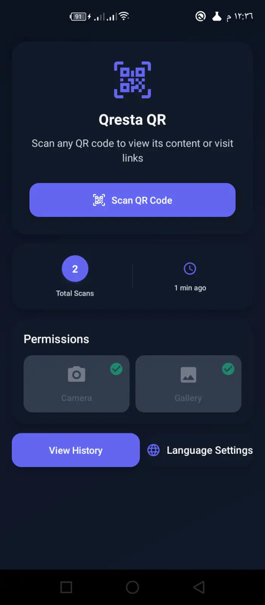
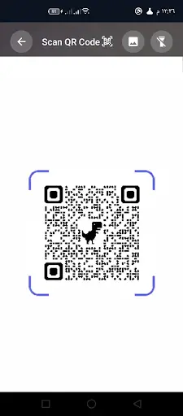
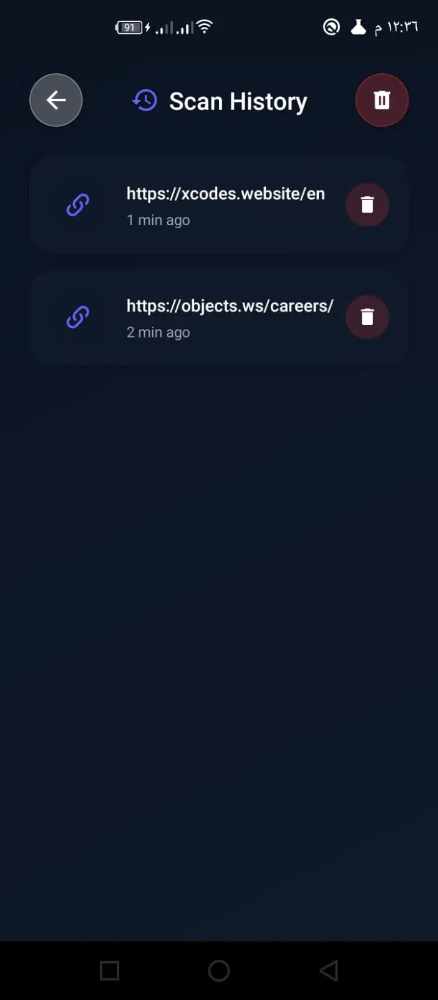
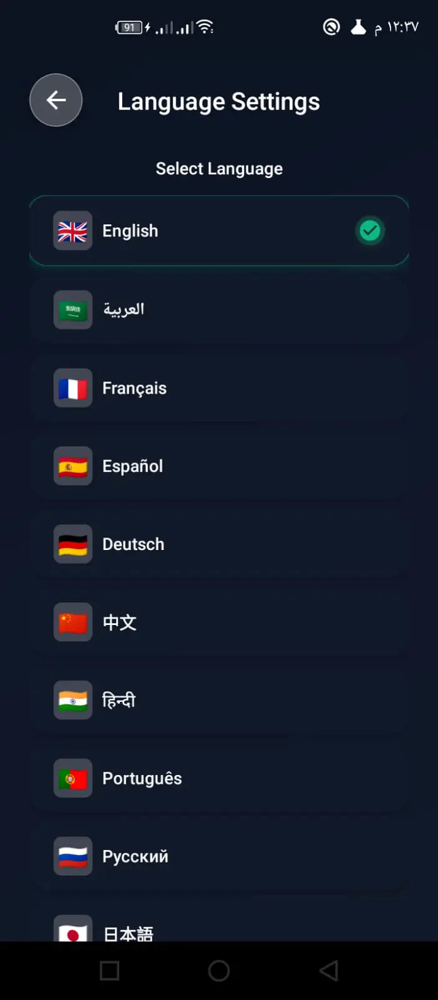

# QrestaQR - Professional QR Scanner

A production-ready, offline-first QR code scanner built with React Native CLI for Android and iOS. Features enterprise-grade architecture, comprehensive internationalization (20 languages), and monetization through non-intrusive advertising.

## Overview

QrestaQR is a professional mobile application demonstrating modern React Native development practices with clean architecture, centralized design systems, and production-ready code quality. The app works seamlessly offline, provides camera and gallery-based QR scanning, maintains persistent history, and supports 20 languages with full RTL (right-to-left) layout support.

**Target Platforms:** Android, iOS  
**Offline-First:** Full functionality without internet connection  
**Monetization:** Optional banner ads (Android) with intelligent online/offline detection  
**Use Cases:** Consumer QR scanning, enterprise inventory management, event check-ins, URL shortening services

## Google Play

Download on Google Play: https://play.google.com/store/apps/details?id=com.qrestaqr

---

## Screenshots

<p align="center">
  
  
  
  
</p>

---

## Key Features

### User-Facing Features

- **High-Performance Camera Scanner** - Real-time QR code detection using Vision Camera with hardware acceleration
- **Gallery Image Scanning** - Import and scan QR codes from existing photos using ML Kit barcode scanning
- **Smart Content Detection** - Automatic URL, email, phone, and text recognition with appropriate action handlers
- **Persistent Scan History** - Unlimited offline storage with timestamps, content preview, and type classification
- **20-Language Support** - Professional translations in English, Arabic, French, Spanish, German, Chinese (Simplified), Hindi, Portuguese, Russian, Japanese, Italian, Korean, Turkish, Dutch, Swedish, Polish, Indonesian, Thai, Persian, and Urdu
- **RTL Layout Support** - Native right-to-left text direction for Arabic, Persian, and Urdu
- **Permission Management** - Graceful camera and gallery permission flows with settings deep-linking
- **Non-Intrusive Advertising** - Optional banner ads (Android) with connection-aware display logic

### Engineering Highlights

- **Centralized Design System** - Professional 8pt grid spacing, semantic typography scale, consistent shadow elevation, and standardized border radius
- **Offline-First Architecture** - App fully functional without network; ads and optional features load when connected
- **Clean Code Architecture** - Clear separation of concerns with dedicated folders for screens, components, hooks, utilities, context, navigation, and configuration
- **Custom Hooks Library** - Reusable logic encapsulation (e.g., `usePermissions` for camera/gallery permission state management)
- **Performance Optimizations** - Debounced scanning (500ms), parallel permission checks, memoized callbacks, efficient list rendering, and proper resource cleanup
- **Memory Safety** - Comprehensive `useEffect` cleanup, no dangling subscriptions, proper async cancellation patterns
- **Platform-Specific Handling** - Android 13+ (API 33) media permissions, iOS SafeArea, native back button support
- **Error Boundaries** - Comprehensive try-catch blocks with user-friendly error messages and graceful degradation
- **Professional Documentation** - JSDoc comments throughout utilities and hooks with parameter types and return values

---

## Architecture Overview

### Folder Structure

```
src/
├── components/              # Reusable UI component library
│   ├── AdBanner.jsx        # Connection-aware ad display (Android)
│   ├── AnimatedButton.jsx  # Spring-animated buttons with size variants
│   ├── Card.jsx            # Elevated card containers with variant support
│   ├── GradientBackground.jsx # Premium gradient backgrounds
│   ├── ScanFrame.jsx       # Animated QR scan frame overlay
│   └── index.js            # Barrel exports for clean imports
├── hooks/                  # Custom React Hooks
│   ├── usePermissions.js   # Camera/gallery permission state management
│   └── index.js            # Barrel exports
├── context/                # Global state management
│   └── HistoryContext.jsx  # Redux-like scan history with reducer pattern
├── screens/                # Application screens
│   ├── SplashScreen.jsx    # Animated launch screen with rings
│   ├── PermissionScreen.jsx # Initial camera permission request
│   ├── HomeScreen.jsx      # Dashboard with stats and navigation
│   ├── ScannerScreen.jsx   # Camera view with torch and gallery picker
│   ├── ResultScreen.jsx    # Scan details with copy/share/open actions
│   ├── HistoryScreen.jsx   # FlatList of scans with delete capability
│   ├── LanguageSettingsScreen.jsx # 20-language selector
│   └── index.js            # Barrel exports
├── navigation/
│   └── AppNavigator.jsx    # React Navigation stack configuration
├── i18n/
│   ├── index.js            # i18next initialization with RTL support
│   ├── validateTranslations.js # Translation key consistency validator
│   └── locales/            # 20 JSON translation files
├── config/
│   └── theme.js            # Comprehensive design system
│                           # COLORS, SPACING, TYPOGRAPHY, SHADOWS, BORDER_RADIUS
└── utils/
    ├── storage.js          # AsyncStorage wrapper with JSDoc
    ├── scanUtils.js        # QR data formatting and type detection
    └── permissions.js      # Cross-platform permission handling
```

### Design Decisions

**Why Offline-First:**  
Network reliability varies globally. By building core functionality without network dependencies, the app provides consistent UX regardless of connectivity. Ads and optional features gracefully enhance the experience when online.

**Why Context API + Reducer:**  
Redux-like predictable state management without external dependencies. The `HistoryContext` provides atomic operations (ADD_SCAN, REMOVE_SCAN, CLEAR_HISTORY) with automatic persistence to AsyncStorage.

**Why Custom Hooks:**  
Encapsulates complex logic (permission checking, async state management) into reusable, testable units. Screens remain focused on UI rendering while hooks handle business logic.

**Why Centralized Design System:**  
Eliminates magic numbers and ensures visual consistency. All spacing values derive from an 8pt grid (`SPACING.sm = 8`, `SPACING.lg = 16`), typography follows semantic naming (`h1`, `body`, `caption`), and shadows use consistent elevation values.

### Scalability & Maintainability

- **Barrel Exports:** Enable clean imports (`import { Card, AnimatedButton } from '../components'`)
- **Single Responsibility:** Each module has one clear purpose
- **No Duplication:** Shared logic extracted to utils and hooks
- **Type Safety:** JSDoc type hints throughout for IDE autocomplete and error detection
- **Testing Ready:** Pure functions, dependency injection, mockable architecture

---

## UI/UX & Design System

### Design Philosophy

The app employs a premium, modern aesthetic with card-based layouts, smooth animations, and intuitive information hierarchy. Visual consistency is maintained through a centralized design system defined in `src/config/theme.js`.

### Design System Tokens

**Spacing (8pt Grid):**

- `xs: 4px` - Minimal spacing between related elements
- `sm: 8px` - Default component internal padding
- `md: 12px` - Standard vertical rhythm
- `lg: 16px` - Primary card padding
- `xl: 24px` - Section spacing
- `xxl: 32px` - Screen-level margins

**Typography:**

- `h1: 32px/bold` - Screen titles
- `h2: 24px/bold` - Section headers
- `h3: 20px/semibold` - Card titles
- `body: 16px/regular` - Primary content
- `bodySmall: 14px/regular` - Secondary text
- `caption: 12px/regular` - Timestamps, metadata

**Shadows (Elevation):**

- `sm: elevation 2` - Subtle depth for inputs
- `md: elevation 4` - Standard button elevation
- `lg: elevation 8` - Card and modal elevation

**Border Radius:**

- `sm: 8px` - Buttons, small containers
- `md: 12px` - Standard cards
- `lg: 16px` - Large cards
- `xl: 20px` - Premium containers
- `full: 999px` - Fully rounded (pills, avatars)

### Animation & Interaction Principles

- **Spring Physics:** Button presses use natural spring animations (scale to 0.95x with bounce)
- **Meaningful Transitions:**
  - Splash → Fade (smooth entrance)
  - Scanner → Fade (focus on camera)
  - Result → Slide from bottom (emergent content)
  - Navigation → Slide from right (hierarchy)
- **Touch Feedback:** All interactive elements provide immediate visual response
- **Performance Target:** 60fps for all animations using React Native's Animated API

### Accessibility & Touch Ergonomics

- **Minimum Touch Targets:** 44×44pt (iOS HIG) / 48×48dp (Material Design)
- **Color Contrast:** Aims for WCAG AA text contrast ratios
- **Clear Labels:** Descriptive button text, no ambiguous icons
- **Large Tap Areas:** Buttons sized for thumb-friendly interaction
- **Status Indicators:** Loading states, error messages, success confirmations

---

## Performance & Reliability

### Offline-First Behavior

**Core Functionality (Always Available):**

- Camera scanning with real-time detection
- Gallery image import and QR extraction
- Complete scan history viewing and management
- Language switching with persistent preferences
- Copy to clipboard and native share functionality

**Optional Features (Online Only):**

- Banner advertising with intelligent connection detection
- URL opening (requires network for web content)

**Connection Management:**

- 3-second timeout on network checks (prevents app freezing)
- Graceful fallback when offline (ads hidden, non-blocking)
- Ads render only when connected (non-blocking)

### Optimized Camera Usage

- **Hardware Acceleration:** Uses Vision Camera's native modules for frame processing
- **Frame Limiting:** Processes frames at optimal intervals (not every frame)
- **Debouncing:** 500ms delay prevents duplicate scans from single QR code
- **Resource Cleanup:** Camera released when screen unmounts or app backgrounds

### State Management & Rendering Efficiency

- **useCallback Memoization:** Event handlers memoized to prevent unnecessary child re-renders
- **Lazy Initialization:** History context loads from storage once on mount
- **Atomic Updates:** State changes batched for efficient reconciliation
- **FlatList Virtualization:** Large history lists render only visible items

### Safe Resource Management

- **Memory Leak Prevention:** All `useEffect` hooks include proper cleanup functions
- **Async Cancellation:** Promises checked before state updates (component may have unmounted)
- **Subscription Cleanup:** Network listeners, camera subscriptions properly disposed
- **Error Boundaries:** Try-catch blocks around all async operations with user-friendly error messages

---

## Internationalization

### Supported Languages (20)

English (`en`), Arabic (`ar`), French (`fr`), Spanish (`es`), German (`de`), Chinese Simplified (`zh`), Hindi (`hi`), Portuguese (`pt`), Russian (`ru`), Japanese (`ja`), Italian (`it`), Korean (`ko`), Turkish (`tr`), Dutch (`nl`), Swedish (`sv`), Polish (`pl`), Indonesian (`id`), Thai (`th`), Persian (`fa`), Urdu (`ur`)

### RTL (Right-to-Left) Support

Automatic layout mirroring for **Arabic**, **Persian**, and **Urdu** with native text direction handling.

### Translation Workflow

All UI strings are extracted to JSON files in `src/i18n/locales/`. The app uses i18next with react-i18next bindings for declarative translations.

**Key Structure Example:**

```json
{
  "home": {
    "title": "QR Scanner",
    "scanButton": "Scan QR Code",
    "historyButton": "View History"
  }
}
```

**Usage in Components:**

```javascript
import { useTranslation } from 'react-i18next';
const { t } = useTranslation();
<Text>{t('home.title')}</Text>;
```

### Translation Validation

A validation tool ensures consistency across all 20 locale files:

**Check Mode (CI/CD):**

```bash
node src/i18n/validateTranslations.js --mode=check
```

**Fix Mode (Development):**

```bash
node src/i18n/validateTranslations.js --mode=fix
```

The validator detects missing keys, structural mismatches, and optionally flags untranslated English strings.

---

## Advertising (Android)

### Overview

Advertising is implemented on Android as an optional bottom banner. It is integrated through a native view bridge and exposed to React Native as a simple component.

The app is designed so that ads never block core functionality and do not appear while offline.

### Connection-Aware Display Logic

```javascript
// Pseudocode: render ads only when online
if (isConnected) {
  renderBannerAd();
}
```

**Behavior:**

- App launches → Check connection (max 3s)
- If offline → Hide banner immediately (no freeze, no error)
- If online → Display banner
- Connection changes → Auto-adjust banner visibility

### UX rules

- Banner positioned at screen bottom (natural eye flow)
- Never blocks primary content or navigation
- Graceful absence when offline (no error states)
- Avoids disruptive refresh/remount behavior

Note: Provider identifiers/keys are intentionally not documented in this public README.

---

## Installation & Development

### Prerequisites

**Required:**

- **Node.js** >= 20.0.0
- **npm** or **yarn**
- **JDK** 17 (for Android)

**Platform-Specific:**

- **Android:** Android Studio + Android SDK (API 33+), Android NDK + CMake (for Vision Camera native builds)
- **iOS:** macOS with Xcode 14+, Command Line Tools, CocoaPods

### Installation Steps

**1. Clone Repository**

```bash
git clone <repository-url>
cd QrestaQR/app
```

**2. Install JavaScript Dependencies**

```bash
npm install
```

**3. iOS Pod Installation (macOS only)**

```bash
cd ios
pod install
cd ..
```

**4. Android NDK Setup (if needed)**
Open Android Studio → SDK Manager → Install Android NDK and CMake

### Running Development Builds

**Android:**

```bash
npm run android
# or
npx react-native run-android
```

**iOS:**

```bash
npm run ios
# or
npx react-native run-ios
```

**Start Metro Bundler (if not auto-started):**

```bash
npm start
```

### Platform-Specific Notes

**Android:**

- Camera permission automatically requested in `AndroidManifest.xml`
- Gallery permission uses `READ_MEDIA_IMAGES` (API 33+) or `READ_EXTERNAL_STORAGE` (older)
- Ad SDK is included at the native layer (Android)

**iOS:**

- Camera permission description in `Info.plist` (`NSCameraUsageDescription`)
- Photo Library access may require `NSPhotoLibraryUsageDescription` depending on the picker/flow
- SafeArea handling for notches and home indicators

---

## Production & Store Readiness

### Google Play Store

**Build APK (Testing):**

```bash
cd android
./gradlew assembleRelease
# Output: android/app/build/outputs/apk/release/app-release.apk
```

**Build AAB (Play Console):**

```bash
cd android
./gradlew bundleRelease
# Output: android/app/build/outputs/bundle/release/app-release.aab
```

**Compliance:**

- Camera/storage permission declarations (review before submission)
- Avoids restricted APIs (verify with Google Play pre-launch checks)
- If ads are enabled, ensure ad content policy compliance
- Privacy policy recommended (mentions local storage and ads)

### iOS App Store

**Build Steps:**

1. Open `ios/QrestaQR.xcworkspace` in Xcode
2. Select "Any iOS Device" as target
3. Product → Archive
4. Distribute to App Store Connect

**Compliance:**

- Camera permission description present
- Proper lifecycle management (no background activity when suspended)
- HIG-aligned touch targets and navigation (verify during QA)
- App Store Review compliance depends on final permissions and metadata

### Security & Privacy Considerations

**Data Storage:**

- All scan history stored locally (no server transmission)
- Language preference stored locally
- No user tracking or analytics

**Permissions:**

- Camera: Required for QR scanning (clear explanation provided)
- Gallery: Optional for scanning saved images
- Network: Used only for ads (app fully functional offline)

**Third-Party Services:**

- Advertising SDK (Android only)
- No other external data transmission

**Release Signing:**

- Keep signing keys and release credentials private
- Use CI/CD secrets or local environment configuration

---

## Troubleshooting

### Metro / Dependencies

**Symptom:** Package resolution errors, version conflicts

```bash
rm -rf node_modules package-lock.json
npm install
npm start -- --reset-cache
```

### Android Build Issues

**Symptom:** Gradle build failures, missing dependencies

```bash
cd android
./gradlew clean
cd ..
npm run android
```

**Vision Camera Native Errors:** Install Android NDK + CMake via SDK Manager

### iOS Build Issues

**Symptom:** Pod installation failures, missing dependencies

```bash
cd ios
rm -rf Pods Podfile.lock
pod install
cd ..
npm run ios
```

**Camera Permission Denied:** Check `Info.plist` for `NSCameraUsageDescription`

### QR Codes Not Scanning

- Ensure adequate lighting (camera needs clear view)
- Hold device steady (focus may take 1-2 seconds)
- Try different distances (optimal: 10-30cm)
- Check camera permission in device settings

### Offline Mode Not Working

- Verify AsyncStorage permissions (should be automatic)
- Check for console errors related to storage
- Try clearing app data and restarting

---

## Technical Stack

Built with modern React Native ecosystem:

- **React Native CLI** 0.82.1
- **React Navigation** (native-stack)
- **Vision Camera** (hardware-accelerated camera)
- **ML Kit Barcode Scanning** (on-device QR detection)
- **AsyncStorage** (persistent offline storage)
- **i18next + react-i18next** (internationalization)
- **react-native-localize** (device locale detection)
- **Native ad SDK (Android)** (banner monetization)
- **NetInfo** (network connectivity detection)
